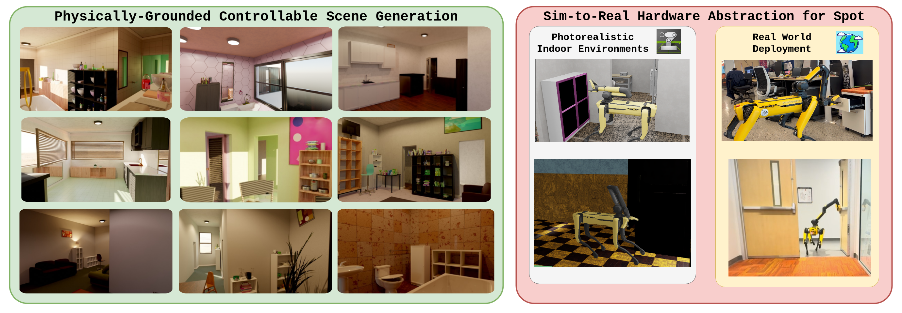

# PhyGS: Physically-Grounded Controllable Scene Generation

[](https://m-and-m-lab.github.io/PhyGS/assets/papers/phygs.pdf)
[](https://m-and-m-lab.github.io/PhyGS/)
[](https://developer.nvidia.com/isaac/sim)
[](LICENSE)

**[Project page](https://m-and-m-lab.github.io/PhyGS)** &nbsp;·&nbsp; **[Paper (CVPR 2026 MEIS Workshop)](https://m-and-m-lab.github.io/PhyGS/assets/papers/phygs.pdf)**

PhyGS is a simulation framework for the controllable generation of photorealistic, building-scale indoor environments with high-fidelity low-level physics, paired with a full agent stack and hardware abstraction layer for the Boston Dynamics Spot with Arm. It is built to generate and evaluate mobile manipulation tasks that are intractable to run at scale in the real world.

<p align="center">
  
</p>

## Abstract

The pursuit of generalist robot policies requires evaluation spanning variations of visual environments and physical interactions intractable for a robot to execute in the real world. We introduce PhyGS, a simulation framework designed for the controllable generation of photorealistic, building-scale indoor environments with high-fidelity low-level physics that bridges the gap between procedural scene synthesis and robotic control. By extending Infinigen-Indoors within the IsaacSim ecosystem, PhyGS transforms static visual backdrops into fully interactable environments through automated object articulation, the assignment of rigid-body physical properties, and the integration of ray-traced lighting. Unlike recent agent-based generative tools that rely on stochastic language models, PhyGS employs a rule-based approach to ensure the controllability required for rigorous benchmarking. Finally, we provide a hardware abstraction layer via a unified API and USD model for the Boston Dynamics Spot robot, demonstrating a seamless transition between simulated evaluation and physical deployment to help identify critical performance gaps in state-of-the-art generalist robotic agents.

## Authors

Aparajito Saha, Zhen Hao Gan, Jinjia Guo, Jacob Skwirsk, Jeremy Acheampong, Anton Arapin, Chahyon Ku, Yue Hu, Nima Fazeli, and Bernadette Bucher.

University of Michigan, Ann Arbor.

## Note on usage

PhyGS is under active development at the Mapping and Motion Lab, and this version of the repository is a beta release intended for early community testing and usage. Please file a GitHub issue detailing any bugs faced or major feature requests, and the team will respond to and resolve these issues as soon as possible. 

## What's in this repository

PhyGS combines three components that previously lived in separate codebases:

1. **Scene generation and export pipeline** — a fork of Infinigen-Indoors extended to add object articulation and semantic population, and to retain physics (joints, collision meshes, rigid-body properties, lighting) through export from Blender to USD.
2. **Agent skills for Spot with Arm in simulation** — low-level controllers (an RL policy for velocity-driven locomotion; LulaIK + cuRobo for 6-DoF arm kinematics and dynamics) and high-level planners (VLFM for semantic navigation, AOGrasp for grasp synthesis).
3. **IsaacSim deployment** — task definitions, physics configuration, and the Docker environment for running the agent in simulation.

These run in **two separate Python environments** that should not be mixed (see [Installation](#installation)).

## Repository structure

```
PhyGS/
├── docs/                          # Top-level documentation
│   └── installation/              # Per-component install guides + overview
│
├── scene_generation/              # Component 1 — Blender / Infinigen Python env
│   └── infinigen/                 # Vendored Infinigen-Indoors fork
│       ├── infinigen/             # Infinigen Python package (assets, core, tools)
│       ├── infinigen_examples/    # `generate_indoors.py` and other entry points
│       ├── scripts/               # Install helpers, USD/articulation export tools
│       ├── docs/                  # Upstream Infinigen docs (Installation, HelloRoom, …)
│       ├── generate_multi.sh      # Batch tmux driver for parallel seed generation
│       └── export_isaacsim_multi.sh  # Batch tmux driver for parallel USD export
│
└── phygs_simulation/              # Component 2 — IsaacLab/IsaacSim container env
    ├── scripts/                   # IsaacLab launchers + the `skills` package
    │   ├── interactive_search.py  # Main launcher (Spot + scene + manipulation)
    │   ├── skills/                # Spot SDK facade + locomotion + manipulation skills
    │   └── helpers/               # Camera, point-cloud, viz helpers
    ├── tests/                     # Pure-Python unit tests + `isaaclab_test/` smoke tests
    ├── docker/                    # IsaacLab cuRobo patch + AO-Grasp sidecar compose
    ├── spot_model/                # Spot USDs, URDFs, cuRobo robot config
    ├── policies/                  # Learned locomotion policy checkpoints
    ├── docs/                      # Component-specific notes and asset catalogs
    └── third_party/               # Git submodules: `ao-grasp/`, `curobo/`
```

The two components live in **two intentionally isolated Python environments** — Infinigen's Blender/`bpy` stack conflicts with IsaacSim/IsaacLab/cuRobo pins. Install and run each independently per the [Installation](#installation) guides. Scene USDs cross the boundary as files only — never as Python imports.

## Installation

PhyGS has two install paths that are independent of each other. The scene generation component can be executed either in a Docker container or a conda environment, while the simulation component must be run inside the base IsaacLab container.

Step-by-step instructions live under [`docs/installation/`](docs/installation/):

| Guide | When to follow it |
| --- | --- |
| [Installation overview](docs/installation/README.md) | Prerequisites, repo clone with submodules, environment-split rationale. Start here. |
| [Scene generation](docs/installation/scene_generation.md) | Installing the Infinigen-Indoors fork in `scene_generation/infinigen/` (conda env, `[sim]` extra). |
| [PhyGS simulation](docs/installation/phygs_simulation.md) | Building the IsaacLab Docker container (IsaacSim 5.1.0 / IsaacLab 2.3.0), AO-Grasp sidecars, smoke tests. |

PhyGS uses git submodules for AO-Grasp + Contact-GraspNet and cuRobo. Clone recursively, or initialize after the fact:

```bash
git clone --recursive https://github.com/m-and-m-lab/PhyGS.git
# Or, on an existing checkout:
git submodule update --init --recursive
```

## Citation

If you use PhyGS in your research, please cite:

```bibtex
@misc{2026phygs,
  title     = {PhyGS: Physically-Grounded Controllable Scene Generation},
  author    = {Saha, Aparajito and Gan, Zhen Hao and Guo, Jinjia and
               Skwirsk, Jacob and Acheampong, Jeremy and Arapin, Anton and
               Ku, Chahyon and Hu, Yue and Fazeli, Nima and Bucher, Bernadette},
  note      = {CVPR Workshop on Multi-Agent Embodied Intelligent Systems},
  year      = {2026}
}
```

## Acknowledgments

PhyGS builds on a number of open-source projects, including: 
[Infinigen / Infinigen-Indoors](https://github.com/princeton-vl/infinigen),
[NVIDIA IsaacSim](https://developer.nvidia.com/isaac/sim),
[IsaacLab](https://github.com/isaac-sim/IsaacLab),
[Objaverse-XL](https://objaverse.allenai.org/),
[cuRobo](https://curobo.org/), 
[VLFM](https://naoki.io/portfolio/vlfm.html), 
[AOGrasp](https://stanford-iprl-lab.github.io/ao-grasp/). 

We thank the authors and maintainers of these tools. Please refer to each project's license and cite them as appropriate.
