# TODO

We want a procedurally generated, interactable, and photorealistic environments.

* procedurally generated (infinigen)
    * examples (05/02)
        

            
overhead-blender

            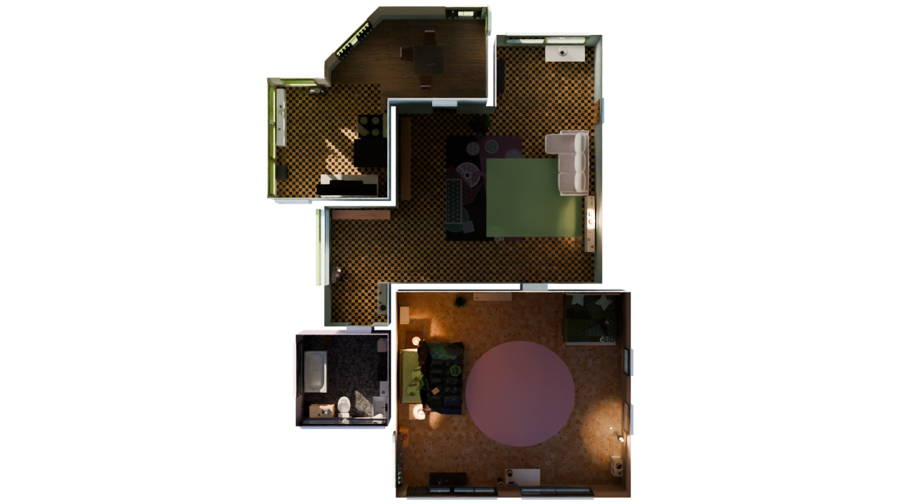
        

        

            
bathroom-blender

            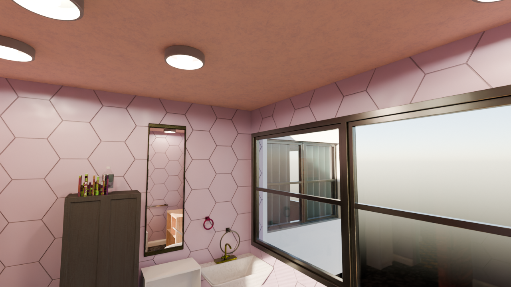
        

        

            
bathroom-isaacsim-naive

            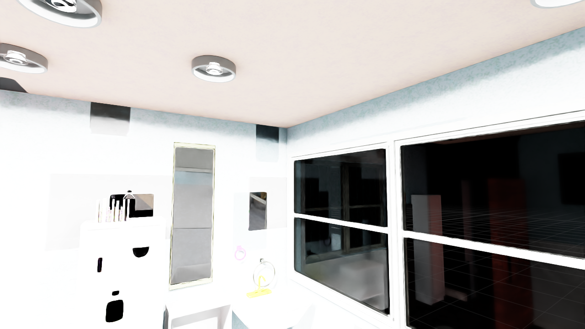
        

        

            
bathroom-isaacsim-handtuned

            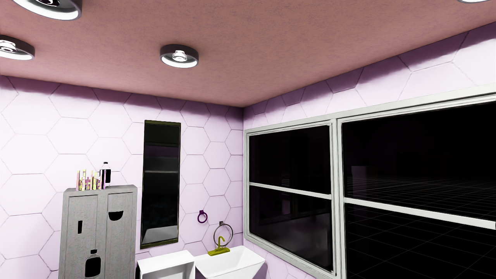
        

        

            
more scenes with more views (05/09)

            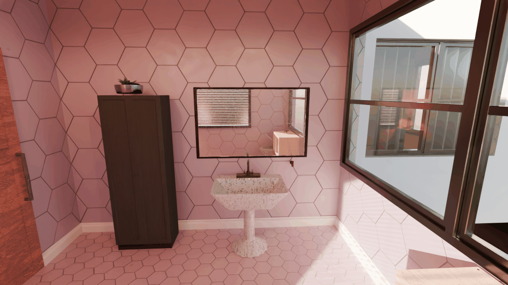
            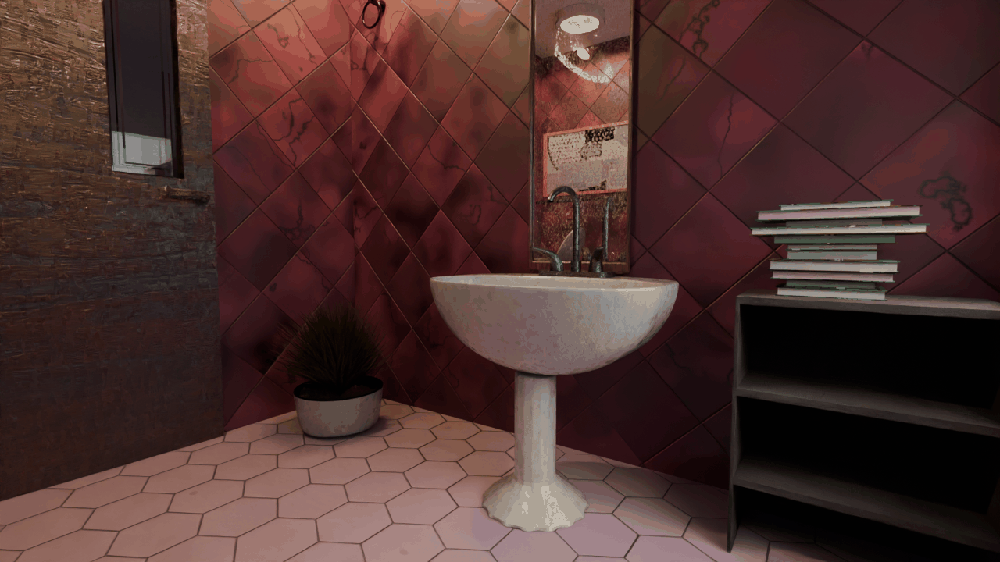
        

    * object generation/placement
        * what does infinigen do? what do other eai benchmarks do?
            

                
25 handheld object categories in infinigen (05/09)

                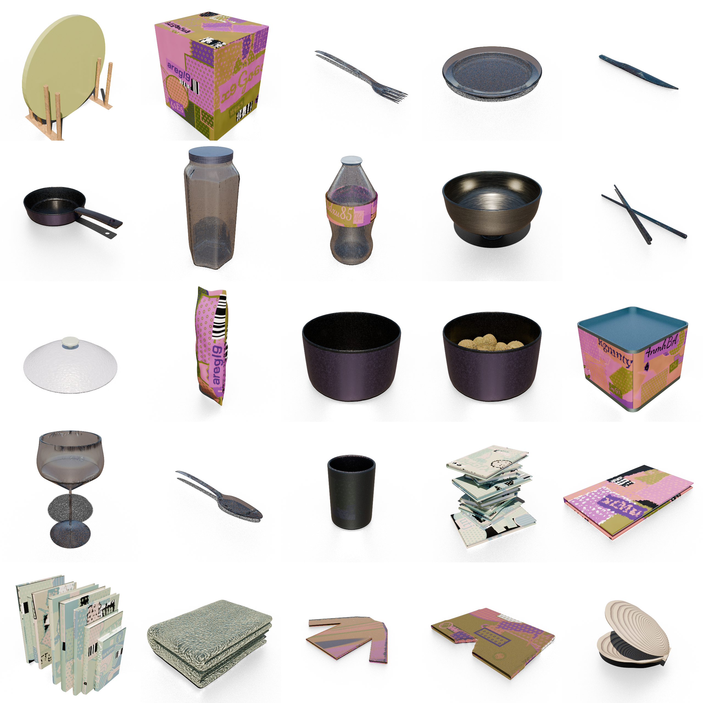
            

        * floorplans (05/09)
            

                
extract object dimensions and locations from blender

                "StandingSinkFactory(4337611).spawn_placeholder(3020338)": { 
                    "type": "MESH", 
                    "dimensions": [ 
                    0.5668395161628723, 
                    0.7741512060165405, 
                    0.72685706615448 
                    ], 
                    "location": [ 
                    3.723379373550415, 
                    1.6784826517105103, 
                    0.655614972114563 
                    ], 
                    "rotation_euler": [ 
                    0.0, 
                    0.0, 
                    -3.141592502593994 
                    ] 
                }, 
                ...
            

            

                
rendered floorplan

                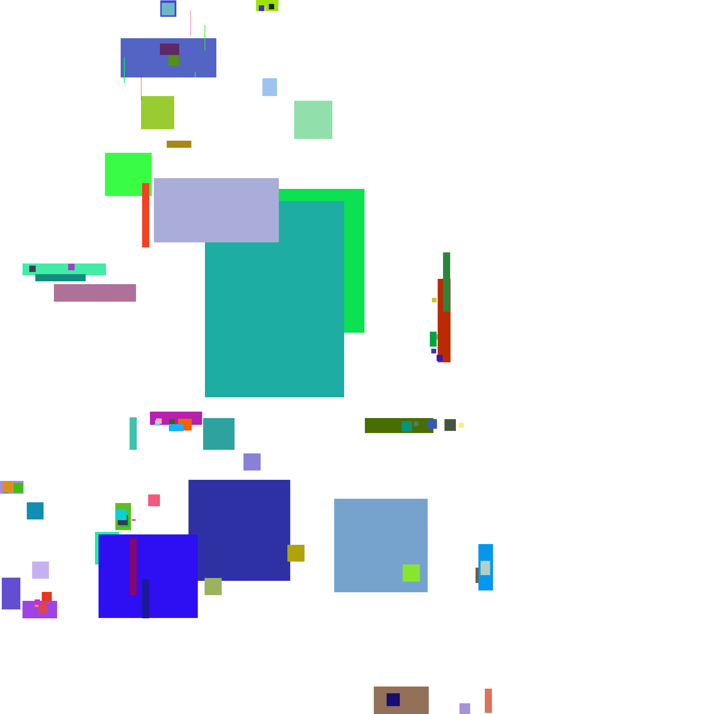
                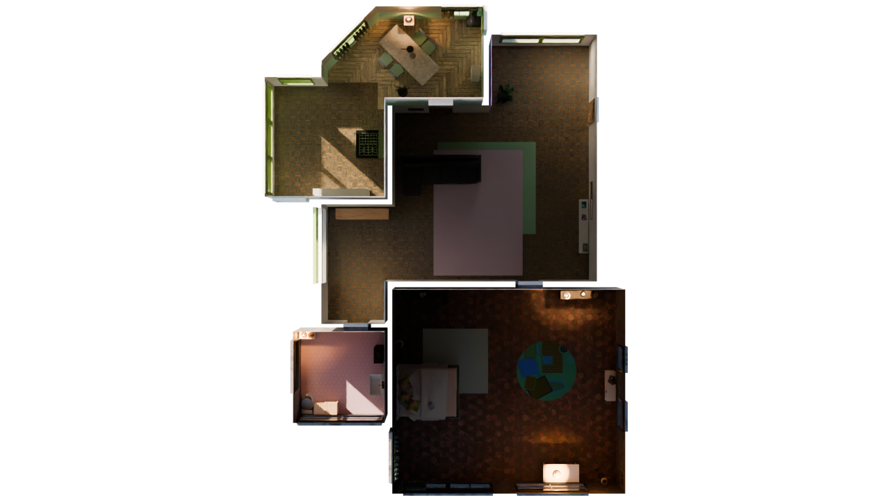
            

        * which objects
            * predefined objects from YCB/GSO?
        * language description? instance label?
        * where
        * how many
        * a separate object placement pipeline after the infinigen scenes are generated
            * up to discussion whether we keep the infinigen assets or generated object
            * *spatial feasilbity* continue exposing parameters, maybe boolean subtraction of mesh possible for empty space recongition
            * *semantic feasibility* clusters, rooms, furniture
    
    * articulation
        * in blender
            

                
simple_cabinets (05/02)

                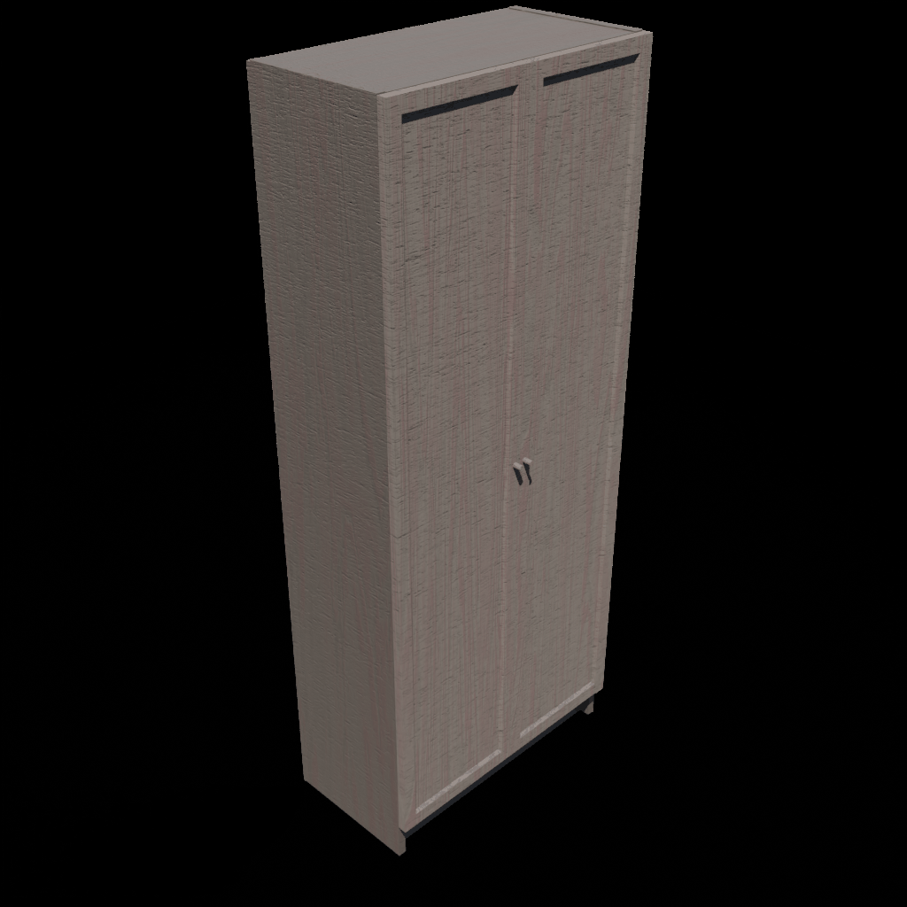
                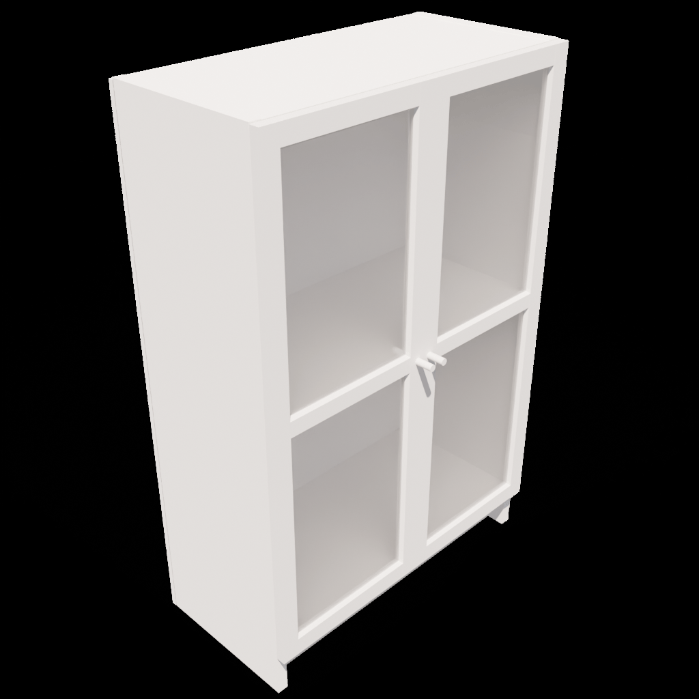
            

            

                
simple_cabinet parameter export (05/09)

                { 
                    "shelf": { 
                        "Dimensions": [ 
                            0.30488135039273245, 
                            0.5860757465489678, 
                            1.4424870384644795 
                        ], 
                        "bottom_board_height": 0.083, 
                        "shelf_depth": 0.29488135039273244, 
                        "shelf_cell_height": [ 
                            0.3398717596161199, 
                            0.3398717596161199, 
                            0.3398717596161199, 
                            0.3398717596161199 
                        ], 
                        "shelf_cell_width": [ 
                            0.5860757465489678 
                        ], 
                        "frame_material": "black_wood" 
                    }, 
                    "door": { 
                        "door_width": 0.3100368788333984, 
                        "num_door": 2, 
                        "door_height": 1.4665120446814333, 
                        "frame_material": null, 
                        "door_left_hinge": true, 
                        "edge_thickness_1": 0.013537073673776953, 
                        "edge_width": 0.03556256505849167, 
                        "edge_thickness_2": 0.005989759277894055, 
                        "edge_ramp_angle": 0.7916421244694045, 
                        "board_thickness": 0.008537073673776954, 
                        "knob_R": 0.005791928675018841, 
                        "knob_length": 0.018826525114771463, 
                        "attach_height": [ 
                            0.07629203209680452, 
                            1.3902200125846287 
                        ], 
                        "has_mid_ramp": false, 
                        "panel_material": [ 
                            null 
                        ] 
                    } 
                } 
            

        * how in isaac sim?
* interactable (isaacsim)
    * examples (05/09)
    * robots (tested in isaacsim and infinigen)
        * observations (done)
        * arm actions (snap-grasp done, no continuous control)
        * leg actions (teleport done, no continuous control)
    * objects (tested in isaacsim, not with infinigen)
        * pick/place (still need verification for infinigen scenes/objects)
        * collision
        * mass
    * articulation (not tested in isaacsim or infinigen)
        * open/close
* photorealistic (infinigen & isaacsim)
    * lack of lights in generation (yue: lighting is controllable)
    * object textures look washed when exported to usd
    * external spatial lights broken in isaacsim