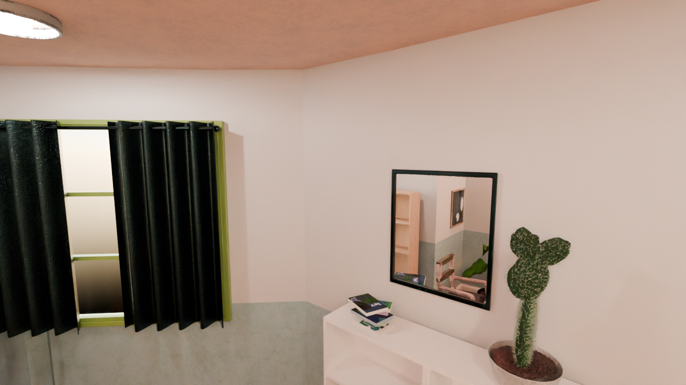
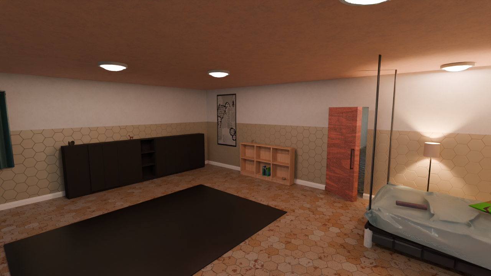
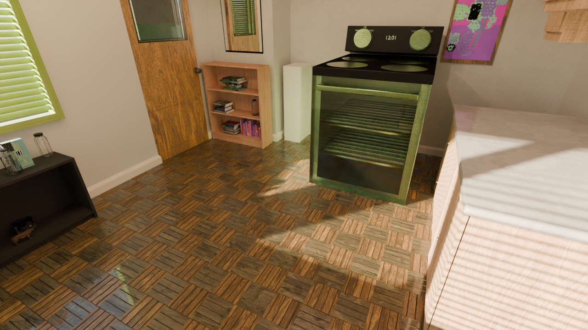
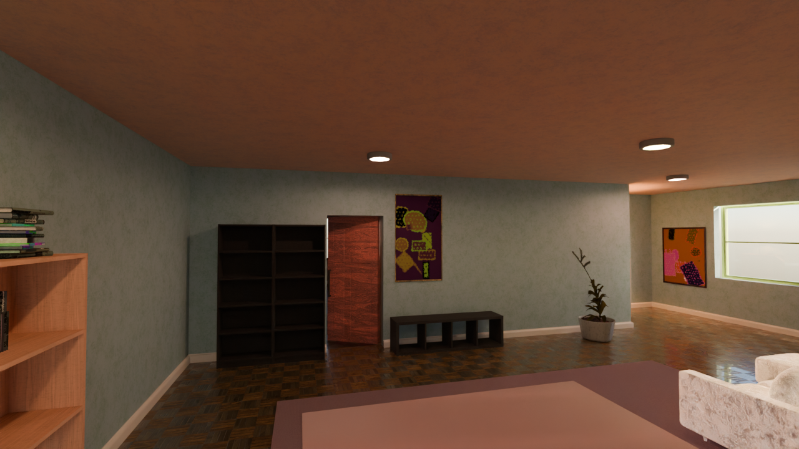
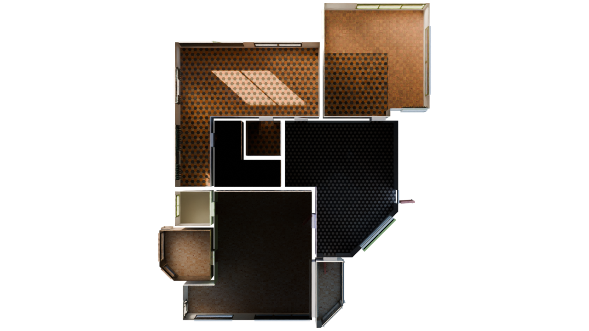
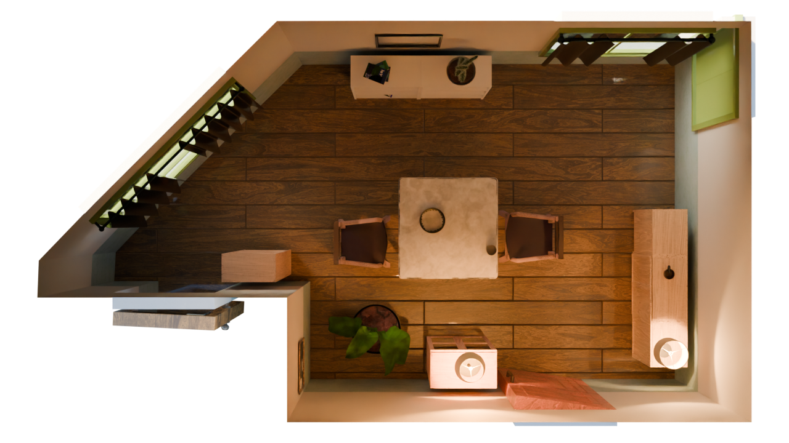

# Diningroom, single room only, first person view (~8min CPU runtime)
```bash
python scripts/generate_indoors.py --seed 0 --task coarse --output_folder outputs/indoors/coarse-dining -g fast_solve.gin singleroom.gin -p compose_indoors.terrain_enabled=False restrict_solving.restrict_parent_rooms=\[\"DiningRoom\"\]
```

# Bathroom, single room only, first person view (~13min CPU runtime)
```bash
python scripts/generate_indoors.py --seed 0 --task coarse --output_folder outputs/indoors/coarse-bathroom -g fast_solve.gin singleroom.gin -p compose_indoors.terrain_enabled=False restrict_solving.restrict_parent_rooms=\[\"Bathroom\"\]
```

# Bedroom, single room only, first person view (~10min CPU runtime)
```bash
python scripts/generate_indoors.py --seed 0 --task coarse --output_folder outputs/indoors/coarse-bedroom -g fast_solve.gin singleroom.gin -p compose_indoors.terrain_enabled=False restrict_solving.restrict_parent_rooms=\[\"Bedroom\"\]
```

# Kitchen, single room only, first person view (~10min runtime, CPU only)
```bash
python scripts/generate_indoors.py --seed 0 --task coarse --output_folder outputs/indoors/coarse-kitchen -g fast_solve.gin singleroom.gin -p compose_indoors.terrain_enabled=False restrict_solving.restrict_parent_rooms=\[\"Kitchen\"\]
```

# LivingRoom, single room only, first person view (~11min runtime, CPU only)
```bash
python scripts/generate_indoors.py --seed 0 --task coarse --output_folder outputs/indoors/coarse-livingroom -g fast_solve.gin singleroom.gin -p compose_indoors.terrain_enabled=False restrict_solving.restrict_parent_rooms=\[\"LivingRoom\"\]
```

# Floor layout, overhead view, no objects (~34 second runtime, CPU only):
```bash
python scripts/generate_indoors.py --seed 0 --task coarse --output_folder outputs/indoors/coarse-noobj-overhead -g no_objects.gin overhead.gin -p compose_indoors.terrain_enabled=False
```

# Single random room with objects, overhead view (~11min. runtime CPU only):
```bash
python scripts/generate_indoors.py --seed 0 --task coarse --output_folder outputs/indoors/coarse-overhead -g fast_solve.gin overhead.gin singleroom.gin -p compose_indoors.terrain_enabled=False compose_indoors.overhead_cam_enabled=True restrict_solving.solve_max_rooms=1 compose_indoors.invisible_room_ceilings_enabled=True compose_indoors.restrict_single_supported_roomtype=True
```

# Whole apartment with objects, overhead view:
```bash
python scripts/generate_indoors.py --seed 0 --task coarse --output_folder outputs/indoors/coarse-apartment -g fast_solve.gin overhead.gin studio.gin -p compose_indoors.terrain_enabled=False
```
